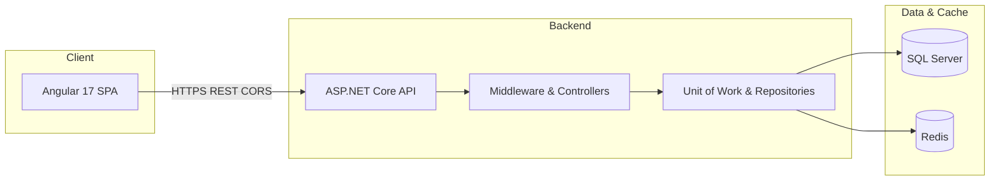

# Ecom-App — .NET 8 + Angular 17

A production-style **e-commerce platform** built with a **layered ASP.NET Core 8 Web API** and an **Angular 17** storefront. The solution demonstrates end-to-end skills in REST API design, authentication, data persistence, caching, and a modern single-page client.

---

## Executive Summary

| Area | What this project shows |
|------|-------------------------|
| **Backend** | Clean separation (API → Infrastructure → Core), EF Core with migrations, Unit of Work + repositories, global exception handling, Swagger documentation |
| **Security** | ASP.NET Core Identity, JWT Bearer flows, account activation and password reset via email |
| **Data & Performance** | SQL Server as the system of record, **Redis** for distributed basket caching |
| **Frontend** | Angular 17 SPA with Bootstrap 5, reusable UI patterns (notifications, loading spinner, pagination), SSR tooling available |
| **DevOps Readiness** | Environment-based configuration, repeatable database migrations, clear local run instructions |

---

## Solution Architecture



- **E-commerce.API** — HTTP pipeline, CORS, Swagger, static files (`wwwroot`), controllers, custom exception middleware.
- **E-commerce.Infrastructure** — DbContext, EF migrations, Identity, Redis connection, email and image services, repository implementations.
- **E-commerce.Core** — Domain-oriented types, DTOs, and abstractions (interfaces) consumed by the API and infrastructure.
- **Frontend** — Angular application consuming the API (default dev server: `http://localhost:4200`).

---

## Features

- Paginated product listing with filtering and search via `ProductParams`
- Product categories
- Product image management (static files served from `wwwroot`)
- Shopping basket backed by Redis
- User registration and login with JWT authentication
- Email account activation and password reset via Gmail SMTP
- Global exception handling middleware with sanitized error responses
- Server-Side Rendering (SSR) support via Angular Universal
- Swagger API documentation (Development mode)

---

## Repository Layout

```
E-commerce/
├── Backend/
│   ├── E-commerce.API/              # Web host, controllers, middleware, appsettings
│   │   ├── Controllers/             # AccountController, ProductsController,
│   │   │                            # CategoriesController, BasketsController
│   │   ├── Mapping/                 # AutoMapper profiles
│   │   ├── Middleware/              # Global exception handling
│   │   └── Helper/                  # Pagination, ApiExceptions, ResponseAPI
│   │
│   ├── E-commerce.Core/             # Domain layer
│   │   ├── Entities/                # Product, Category, Photo, AppUser,
│   │   │                            # CustomerBasket, BasketItem, Address
│   │   ├── DTO/                     # ProductDTO, CategoryDTO, RegisterDTO, EmailDTO
│   │   ├── Interfaces/              # IGenericRepository, IUnitOfWork, IAuth, ...
│   │   └── Services/                # IEmailService, IGenerateToken, IImageManagementService
│   │
│   └── E-commerce.Infrastructure/   # Data access layer
│       ├── Data/
│       │   ├── AppDbContext.cs
│       │   ├── Config/              # EF Fluent API configurations
│       │   └── Migrations/
│       └── Repositories/
│           ├── GenericRepository.cs
│           ├── ProductRepository.cs
│           ├── CategoryRepository.cs
│           ├── CustomerBasketRepository.cs
│           ├── AuthRepository.cs
│           ├── UnitOfWork.cs
│           └── Services/            # EmailService, GenerateToken, ImageManagementService
│
└── Frontend/
    └── src/app/
        ├── shop/                    # Product listing + product details
        ├── basket/                  # Shopping cart
        ├── checkout/                # Checkout flow
        ├── identity/                # Login, Register, Reset Password, Activation
        ├── home/                    # Landing page
        ├── core/                    # NavBar, Loading service, HTTP Interceptor
        └── shared/                  # Shared components (Pagination, OrderTotal) + Models
```

---

## Technology Stack

### Backend

| Technology | Version | Role |
|---|---|---|
| .NET / ASP.NET Core | 8 | Runtime, Web API, middleware, static files |
| Entity Framework Core | 8.0.23 | ORM, SQL Server provider, migrations |
| ASP.NET Core Identity | 8.0.23 | Users, roles, tokens |
| JWT Bearer | 8.0.25 | API authentication |
| StackExchange.Redis | 2.11.0 | Basket / distributed cache |
| AutoMapper | 12.0.1 | Entity ↔ DTO mapping |
| MimeKit | 4.15.1 | Transactional email (Gmail SMTP) |
| Swashbuckle | 8.1.4 | OpenAPI / Swagger UI |

### Frontend

| Technology | Version | Role |
|---|---|---|
| Angular | ^17.3.0 | SPA framework, routing, forms |
| Angular SSR | ^17.3.17 | Server-Side Rendering |
| Bootstrap | ^5.3.8 | Layout and styling |
| Font Awesome | ^7.1.0 | Icons |
| Material Icons | ^1.13.14 | Icons |
| ngx-bootstrap | ^11.0.2 | Pagination component |
| ngx-toastr | ^17.0.2 | Toast notifications |
| ngx-spinner | ^21.0.0 | Loading spinner |
| ngx-image-zoom | ^3.0.0 | Product image zoom |
| uuid | ^13.0.0 | Basket ID generation |
| RxJS | ~7.8.0 | Reactive programming |

---

## Prerequisites

- [.NET 8 SDK](https://dotnet.microsoft.com/download/dotnet/8.0)
- [SQL Server](https://www.microsoft.com/sql-server) (local or remote)
- [Redis](https://redis.io/) reachable from the API (default: `localhost`)
- [Node.js](https://nodejs.org/) LTS and npm
- Angular CLI: `npm install -g @angular/cli@17`

---

## Getting Started

### 1. Clone the repository

```bash
git clone https://github.com/ziad-abdo96/Ecom-App.Net-8-With-Angular.git
cd Ecom-App.Net-8-With-Angular
```

### 2. Configure the Backend

Create `Backend/E-commerce.API/appsettings.json` using the template below:

```json
{
  "Logging": {
    "LogLevel": {
      "Default": "Information",
      "Microsoft.AspNetCore": "Warning"
    }
  },
  "AllowedHosts": "*",
  "ConnectionStrings": {
    "Ecom": "Server=.;Database=Ecom;Trusted_Connection=True;TrustServerCertificate=True;MultipleActiveResultSets=True;",
    "Redis": "localhost"
  },
  "EmailSetting": {
    "Port": 587,
    "From": "your-email@gmail.com",
    "UserName": "your-email@gmail.com",
    "Password": "your-gmail-app-password",
    "smtp": "smtp.gmail.com"
  },
  "Token": {
    "Secret": "your-strong-secret-key-minimum-32-characters",
    "Issuer": "https://localhost:44350/"
  }
}
```

> **Gmail:** Use a [Gmail App Password](https://support.google.com/accounts/answer/185833), not your real account password.

### 3. Apply Database Migrations

Install the EF Core CLI tool (once per machine):

```bash
dotnet tool install --global dotnet-ef
```

Apply migrations:

```bash
cd Backend/E-commerce.API
dotnet ef database update --project ../E-commerce.Infrastructure/E-commerce.Infrastructure.csproj
```

### 4. Start Redis

```bash
# Via Docker (recommended)
docker run -d -p 6379:6379 redis

# Or start your local Redis server
redis-server
```

### 5. Run the Backend

```bash
cd Backend/E-commerce.API
dotnet run
```

| Profile | URL |
|---|---|
| HTTP | `http://localhost:5049` |
| HTTPS | `https://localhost:7198` |
| Swagger UI | `https://localhost:7198/swagger` |

### 6. Run the Frontend

```bash
cd Frontend
npm install
npm start
```

App available at: `http://localhost:4200`

---

## API Surface

Base route pattern: **`api/[controller]`**

| Controller | Endpoints |
|---|---|
| **Products** | `GET /get-all` · `GET /get-by-id/{id}` · `POST /add-product` · `PUT /update-product` · `DELETE /delete-product/{id}` |
| **Categories** | `GET /get-all` · `GET /get-by-id/{id}` |
| **Account** | `POST /Register` · `POST /Login` · `POST /active-account` · `GET /send-email-forget-password` · `POST /reset-password` |
| **Baskets** | `GET /get-basket-item/{id}` · `POST /update-basket` · `DELETE /delete-basket/{id}` |

Full interactive documentation available via **Swagger UI** when running in Development mode.

---

## Build

```bash
# Backend
cd Backend/E-commerce.API
dotnet build

# Frontend production build
cd Frontend
npm run build

# Frontend tests
npm test
```

---

## Security Notes

> **Important before pushing to any repository:**

- Add `appsettings.json` to `.gitignore` — it contains secrets
- Use [User Secrets](https://learn.microsoft.com/aspnet/core/security/app-secrets) locally and a secure vault or CI variables in production
- Use [Gmail App Passwords](https://support.google.com/accounts/answer/185833) not your real Gmail password
- CORS is configured for `http://localhost:4200` — update `Program.cs` for production deployments

```bash
echo "appsettings.json" >> .gitignore
echo "appsettings.Development.json" >> .gitignore
```

---

## Contributing

1. Fork the repository
2. Create a feature branch: `git checkout -b feature/your-feature`
3. Commit your changes: `git commit -m "Add some feature"`
4. Push to the branch: `git push origin feature/your-feature`
5. Open a Pull Request

---

## License

This repository is for **portfolio / educational** use unless otherwise stated by the author.

---

## Author

**Ziad Abdo** — [@ziad-abdo96](https://github.com/ziad-abdo96)